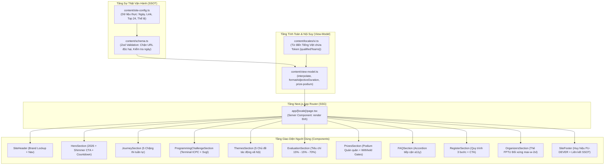

# Kiến trúc Hệ thống Website AI for Impact 2026 (System Architecture)

> **Cuộc thi:** AI for Impact 2026 – Agentic Innovation Challenge  
> **Đơn vị chủ trì & đăng cai:** Trường Đại học FPT Đà Nẵng  
> **Tên miền chính thức:** `AI.Impact.fptu.vn`  
> **Công nghệ lõi:** Next.js 14 App Router, Static Export (`output: 'export'`), TypeScript Strict, Tailwind CSS, Vitest  
> **Bộ nhớ Agent:** TencentDB Agent Memory Central Hub (`:8420`, `:8424`)  

---

## 1. Tổng quan & Triết lý Thiết kế (System Overview)

Website **AI for Impact 2026** được xây dựng dưới dạng **Single-Page Landing Experience cao cấp**, tối ưu hóa cho tốc độ tải trang cực nhanh, khả năng tiếp cận WCAG 2.2 AA và trải nghiệm chuyển đổi (conversion) đăng ký tham gia cuộc thi.

### Triết lý Cốt lõi:
1. **Single Source of Truth (SSOT):** Mọi sự thật vận hành (ngày thi, hạn đăng ký, link form, số lượng đội tuyển, cơ cấu giải thưởng) được quản trị tập trung tại một tệp cấu hình duy nhất.
2. **Clean Tech Light Aesthetics:** Tông màu sáng hiện đại, thanh lịch kết hợp kính mờ phủ sương `.glass-card` đa tầng và sắc cam FPT rực rỡ (`#FF6B00`) làm điểm nhấn năng lượng.
3. **Zero Operational Drift:** Không hardcode dữ liệu vào JSX hay từ điển ngôn ngữ.
4. **Static Export First:** 100% mã nguồn được biên dịch tĩnh thành HTML/CSS/JS, loại bỏ sự phụ thuộc vào Node.js runtime khi phát hành production.

---

## 2. Sơ đồ Luồng Dữ liệu (Data Flow Architecture)



---

## 3. Cấu trúc Thư mục Dự án (Directory Structure)

```
AIforImpact/
├── app/                           # Next.js 14 App Router
│   ├── [locale]/
│   │   ├── layout.tsx             # Locale-aware layout wrapper
│   │   └── page.tsx               # Trang đích chính (Server Component)
│   ├── favicon.ico                # Favicon nhị phân đa độ phân giải FPT 3 màu (12.7 KB)
│   ├── icon.svg                   # Vector SVG icon chính thức
│   ├── icon.png                   # PNG icon 64x64
│   ├── globals.css                # CSS Variables, Utility Classes, Shimmer keyframes
│   └── layout.tsx                 # Root layout (Fonts Google: Inter, Space Grotesk, JetBrains Mono)
├── components/                    # Thành phần Giao diện
│   ├── icons/                     # Vector icons nội bộ (FptSymbol.tsx)
│   ├── layout/                    # Thành phần Khung (SiteHeader, SiteFooter)
│   ├── sections/                  # Các khối nội dung chính của landing page
│   │   ├── HeroSection.tsx        # Hero với Countdown & CTA Shimmer
│   │   ├── AboutSection.tsx       # Bối cảnh & Mục tiêu AI for Impact
│   │   ├── JourneySection.tsx     # 5 Chặng thi tuần tự
│   │   ├── ProgrammingChallengeSection.tsx # Terminal ICPC Compiler Specs & Svgl
│   │   ├── StageComparisonSection.tsx      # Bảng đối soát Vòng Kỹ thuật vs Chung kết
│   │   ├── AgentAnatomySection.tsx         # 4 Lớp giải phẫu AI Agent & Ranh giới MVP
│   │   ├── ThemesSection.tsx      # 5 Lĩnh vực bài toán tác động xã hội
│   │   ├── TeamRolesSection.tsx   # Phân vai chiến thuật đội hình 4-5 thành viên
│   │   ├── EvaluationSection.tsx  # Cơ cấu chấm điểm (15-15-70)
│   │   ├── PrizesSection.tsx      # Bục trao giải thưởng
│   │   ├── RegisterSection.tsx    # Hướng dẫn đăng ký & 6 câu hỏi video ý tưởng
│   │   ├── FAQSection.tsx         # Câu hỏi thường gặp
│   │   └── OrganizersSection.tsx  # Thẻ FPTU Đối xứng max-w-2xl (Clean Centered Showcase)
│   ├── ui/                        # Các nguyên tử UI dùng chung (Button, Card, Badge, Accordion)
│   └── visuals/                   # Đồ họa chuyên sâu (AgentNetworkVisual, JourneyPath)
├── content/                       # Quản lý Nội dung & SSOT
│   ├── locales/                   # Bản dịch (vi.ts, en.ts)
│   ├── site-config.ts             # SINGLE SOURCE OF TRUTH (Toàn bộ sự thật vận hành)
│   ├── schema.ts                  # Zod validation schemas
│   ├── types.ts                   # TypeScript interfaces định nghĩa cấu trúc dữ liệu
│   └── view-model.ts              # Xử lý nội suy dữ liệu và logic bục giải thưởng
├── docs/                          # Tài liệu Kỹ thuật & ADR
│   ├── decisions/                 # Architecture Decision Records (ADR-001, 002, 003, 004)
│   ├── ARCHITECTURE.md            # Tài liệu Kiến trúc Hệ thống này
│   ├── CODE_AUDIT.md              # Báo cáo kiểm định chất lượng mã nguồn
│   └── LOCKED_FACTS.md            # Hồ sơ khóa dữ liệu thực tế cuộc thi
├── public/                        # Tài nguyên tĩnh
│   ├── apple-touch-icon.png       # Apple Touch Icon 256x256
│   ├── favicon.ico                # Favicon FPT 3 màu (12.7 KB)
│   ├── icon.svg                   # Vector SVG icon
│   ├── icon.png                   # PNG icon
│   ├── brand/                     # Logo Trường ĐH FPT Đà Nẵng, FU-DEVER, Posters
│   └── icons/                     # SVG Icons chuẩn hãng từ Svgl (C, C++, Java, Python, Gemini, DeepSeek, Docker, Zalo)
├── scripts/                       # Kịch bản tự động hóa
│   └── build-favicons.mjs         # Trình biên dịch đa kích thước Favicon FPT (@resvg/resvg-js)
├── tests/                         # Bộ kiểm thử tự động Vitest (52/52 pass 100%)
│   ├── config.test.ts             # Kiểm thử toàn vẹn SSOT
│   ├── content-model.test.ts      # Kiểm thử nội suy biến mẫu & mutation
│   ├── dates.test.ts              # Kiểm thử định dạng thời gian & múi giờ
│   └── locales.test.ts            # Kiểm thử tính đối sánh ngôn ngữ
├── AGENTS.md                      # Chỉ thị vận hành Agent & Quy chuẩn Bất biến
├── next.config.js                 # Cấu hình Next.js Static Export
├── tailwind.config.ts             # Định nghĩa Design System Tokens
└── package.json                   # Dependencies và NPM Scripts
```

---

## 4. Hệ thống Thiết kế Clean Tech Light (Design System)

### Bảng màu Phối thức (Color Palette):
- **Nền tảng (60%):** `#FFFFFF` (Trắng tinh khiết) và `#F8FAFC`, `#F1F5F9` (Slate/Porcelain phân tầng).
- **Cấu trúc chữ & Viền (30%):**
  - Chữ chính: `#0F172A` (Slate 900) – Độ tương phản cao.
  - Chữ phụ: `#334155` (Slate 700), `#64748B` (Slate 500).
  - Viền thẻ: `border-slate-200` (`#E2E8F0`).
- **Điểm nhấn Thương hiệu & Hành động (10%):**
  - Cam FPT Rực rỡ: `#FF6B00` (Hover: `#EA580C`).
  - Xanh Công nghệ: `#2563EB` (Blue 600).

### Lớp phủ & Chiều sâu (Elevation & Surfaces):
- `.glass-card`: Lớp kính mờ trắng phủ sương `rgba(255, 255, 255, 0.92)` với bóng đổ `shadow-card` và hiệu ứng hover `shadow-card-hover`.
- `.glass-card-orange`: Gradient cam ấm nhẹ `from-orange-50/80 via-amber-50/40 to-white` dành riêng cho giải Vô địch và CTA Đăng ký.
- **Clean Tech Light IDE Window:** Khung hiển thị môi trường lập trình ICPC và cấu hình compiler với bề mặt kính trắng mờ phủ sương cao cấp (`bg-white/95 backdrop-blur-md`), thanh điều hướng Mac Titlebar trang nhã và nút sao chép lệnh biên dịch tức thì, hòa hợp 100% với ngôn ngữ thiết kế chung.

---

## 5. Quy chuẩn Bất biến Thương hiệu (Brand Invariants)

1. **Cuộc thi KHÔNG CÓ LOGO CHÍNH THỨC:**
   - Tuyệt đối không tự tạo hoặc sử dụng logo ảnh giả lập.
   - Nhận diện cuộc thi sử dụng **Brand Lockup dạng chữ cao cấp (`AI FOR IMPACT 2026`)** kết hợp **Biểu tượng FPT 3 màu vector chuẩn nhận diện** tại Header, logo **Trường Đại học FPT Đà Nẵng** tại mục Đơn vị chủ trì, và huy hiệu bản quyền **CLB Lập Trình FU-DEVER** ([`fudever.com`](https://fudever.com)) tại Footer.
2. **Khai thác Logo Công nghệ từ [Svgl](https://svgl.app/):**
   - Hệ thống vector sắc nét chuẩn công nghiệp tại `public/icons/`:
     - Compilers ICPC: C (`c.svg`), C++ (`cpp.svg`), Java (`java.svg`), Python (`python.svg`).
     - AI Models & Frameworks: OpenAI (`openai.svg`), Claude (`claude.svg`), Gemini (`gemini.svg`), DeepSeek (`deepseek.svg`), Hugging Face (`huggingface.svg`).
     - Deployment: Docker (`docker.svg`).
     - Candidate Support: Zalo (`zalo.svg`).

---

## 6. Kết nối TencentDB Agent Memory Central Hub

Bộ nhớ dài hạn của dự án được duy trì qua TencentDB Agent Memory Central Hub:
- **Loopback Hub:** `http://127.0.0.1:8420` (tenant `aiforimpact`).
- **Knowledge Service:** `http://127.0.0.1:8424`.
- **Lệnh Ghi nhận Quyết định Kỹ thuật (Capture):**
  ```bash
  node c:/Users/ADMIN/_Project/agent-memory-hub/connectors/memory_cli.mjs capture "<Tiêu đề>" "<Mô tả quyết định>" aiforimpact
  ```
- **Lệnh Tra cứu Ngữ cảnh (Recall):**
  ```bash
  node c:/Users/ADMIN/_Project/agent-memory-hub/connectors/memory_cli.mjs recall "<Nội dung cần tìm>" aiforimpact
  ```

---

## 7. Quy trình Kiểm thử & Phát hành (Verification Pipeline)

Mọi thay đổi mã nguồn trước khi hợp nhất bắt buộc phải vượt qua 4 chặng kiểm duyệt:

```bash
# 1. Kiểm tra kiểu TypeScript (0 lỗi)
npm run typecheck

# 2. Kiểm tra chuẩn mã nguồn ESLint (0 cảnh báo / lỗi)
npm run lint

# 3. Chạy 100% bộ kiểm thử tự động Vitest (52/52 tests pass)
npm test

# 4. Biên dịch xuất bản tĩnh Next.js Static Export
npm run build
```

Sau khi hoàn tất kiểm tra, triển khai bản phát hành trực tiếp lên hạ tầng sản xuất:
```bash
# Triển khai Vercel Production
npx vercel --prod --yes
```

Bản phân phối tĩnh hoàn tất tại thư mục `out/`, cổng live preview tại: **`http://localhost:3000/vi`**.
